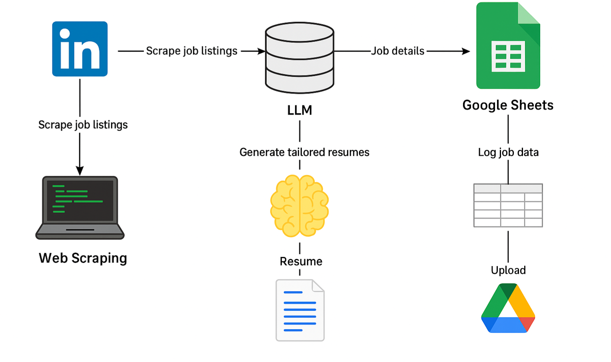

# JobAutomation

Automate your job search with ease! This Python-based personal project scrapes LinkedIn job listings, tailors resumes using Google Gemini, and logs everything neatly into Google Sheets for streamlined tracking and record keeping.

---

## 🚀 Features

- **Job Scraping**: Automatically extract the latest job postings from LinkedIn using BeautifulSoup.  
- **Resume Customization**: Leverage Google Gemini's powerful language model to tailor resumes specifically for each job.  
- **Google Drive Integration**: Upload your tailored resumes and related documents directly to Google Drive.  
- **Centralized Tracking**: All job applications, statuses, and metadata are logged in Google Sheets for easy monitoring and follow-up.  

---

## 🛠️ Technologies Used

- Python  
- Google Gemini API  
- BeautifulSoup for web scraping  
- Google Drive and Sheets APIs for file management and logging  

---

## ⚙️ Usage Notes

This project is a personal automation tool and requires setting up Google API credentials and environment variables. Due to its personalized nature, detailed setup instructions are omitted here.  

Feel free to explore the code for ideas or customize it to your own job search workflow!

---

## 📂 Repository Structure

- `main.py` — Core script orchestrating the job automation workflow.  
- `scrapper.py` — Handles job listings extraction.  
- `gemini.py` — Interacts with Google Gemini for resume tailoring.  
- `googlesheets.py` — Manages logging of applications into Google Sheets.  
- `Driveapi.py` — Uploads resumes and documents to Google Drive.  

---

## 🙏 Acknowledgments

Inspired by the desire to automate tedious job application tasks and make job hunting more efficient.

---

